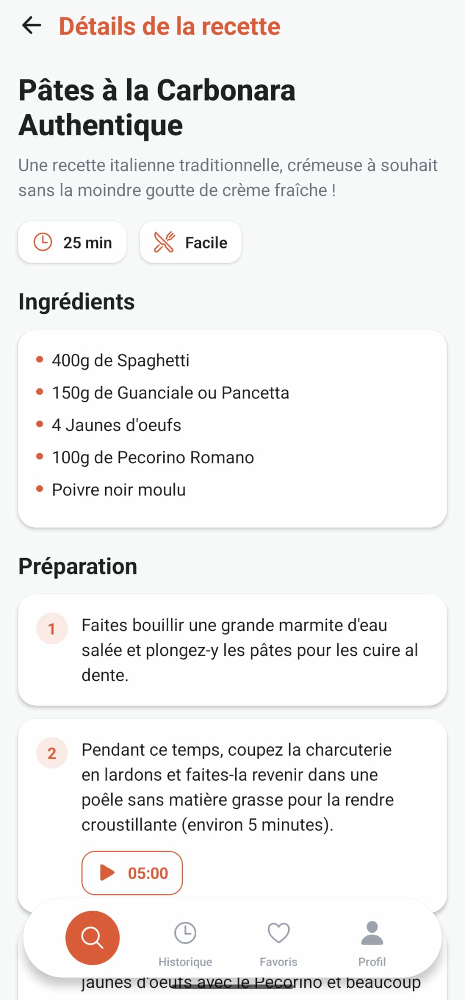
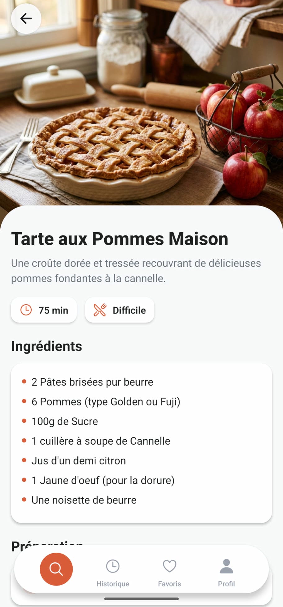

  &nbsp;&nbsp;&nbsp;&nbsp;&nbsp;&nbsp;&nbsp;&nbsp;&nbsp;&nbsp;&nbsp;&nbsp;
  &nbsp;&nbsp;&nbsp;&nbsp;&nbsp;&nbsp;&nbsp;&nbsp;&nbsp;&nbsp;&nbsp;&nbsp;
  

# NoGaspi

NoGaspi is a mobile application designed to help you reduce food waste by generating delicious recipes based on the ingredients you already have at home. Select your available ingredients, and let the app suggest creative ways to use them up.

## Features

*   **Ingredient Selection:** Easily search and select ingredients you currently have in your kitchen.
*   **Recipe Generation:** Generate tailored recipe suggestions based on your selected ingredients.
*   **Favorites:** Save the recipes you love the most for quick access later.
*   **History:** View your previously generated recipes.
*   **Profile Management:** Customize your user profile and preferences.

## Tech Stack

*   **Framework:** React Native
*   **Toolchain:** Expo
*   **Language:** TypeScript
*   **Styling:** React Native StyleSheet
*   **Icons:** Expo Vector Icons (Ionicons)
*   **Animations:** Lottie React Native

This will open the Expo developer tools in your browser. From there, you can:

*   Run the app on an Android emulator or iOS simulator.
*   Scan the QR code with the Expo Go app on your physical device to run it directly.

Alternatively, you can start the app directly for a specific platform:

*   **Android:** `npm run android`
*   **iOS:** `npm run ios`
*   **Web:** `npm run web`

## Project Structure

*   `src/`: Main source code directory.
    *   `core/`: Core functionalities like themes and constants.
    *   `presentation/`: UI components, screens, and custom hooks.
        *   `components/`: Reusable UI elements (e.g., BottomMotionBar).
        *   `screens/`: Main application screens (Home, History, Favorites, Profile, etc.).
        *   `hooks/`: Custom React hooks (e.g., useIngredientSelection).
*   `assets/`: Static assets like images and fonts.
*   `App.tsx`: Main entry point of the application.

## License

Please refer to the LICENSE file in the repository for more information.
